class: center middle inverse

# ANATOMY

---

# The vocal tract

.pull-left[
.center[
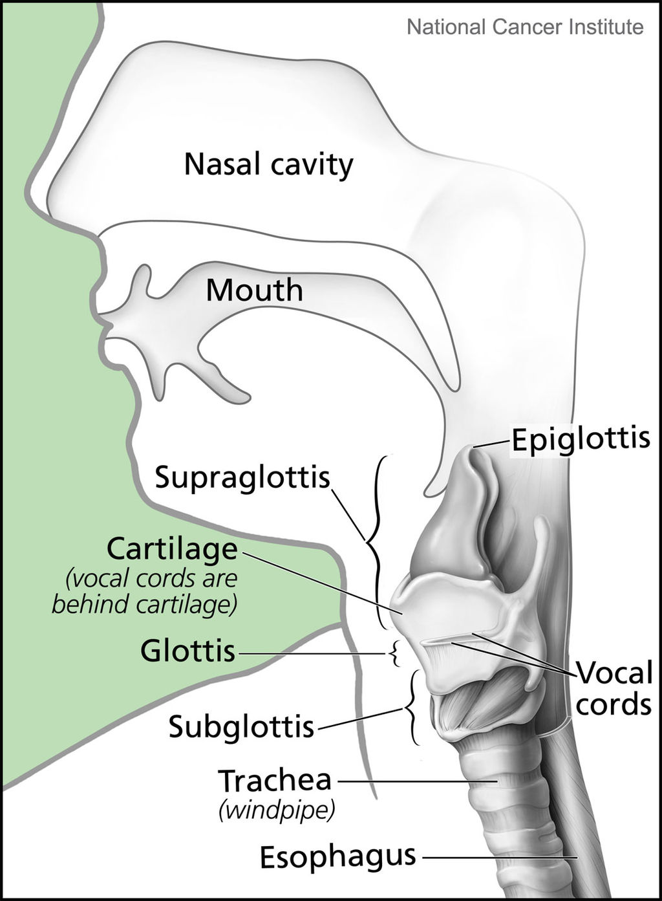
]]

.pull-right[
.center[
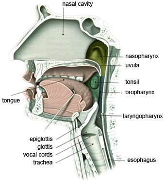
]]

???

Images:

- <a href="https://commons.wikimedia.org/wiki/File:Larynx_and_nearby_structures.jpg">Alan Hoofring (Illustrator)</a>, Public domain, via Wikimedia Commons
- https://thebrain.mcgill.ca/flash/capsules/outil_bleu21.html

---

# The larynx

.pull-left[
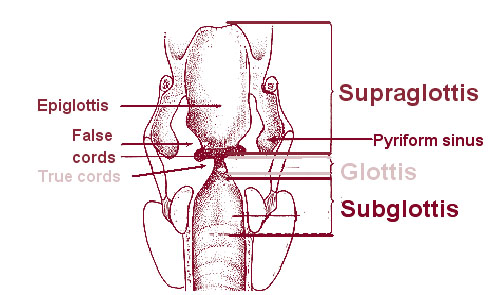
]

.pull-right[
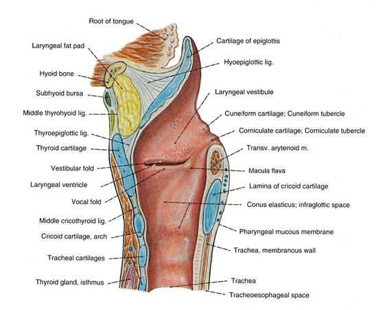
]

???

- https://commons.wikimedia.org/wiki/File:Illu07_larynx01.jpg
- https://www.pinterest.co.uk/pin/565201821964547797/

---

# The larynx

.center[
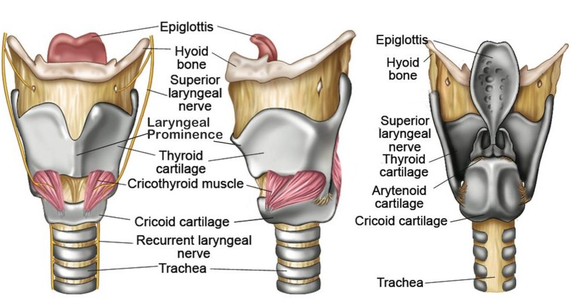
]

???

- https://www.online-sciences.com/wp-content/uploads/2021/06/larynx-999.jpg

---

# The vocal folds

.center[
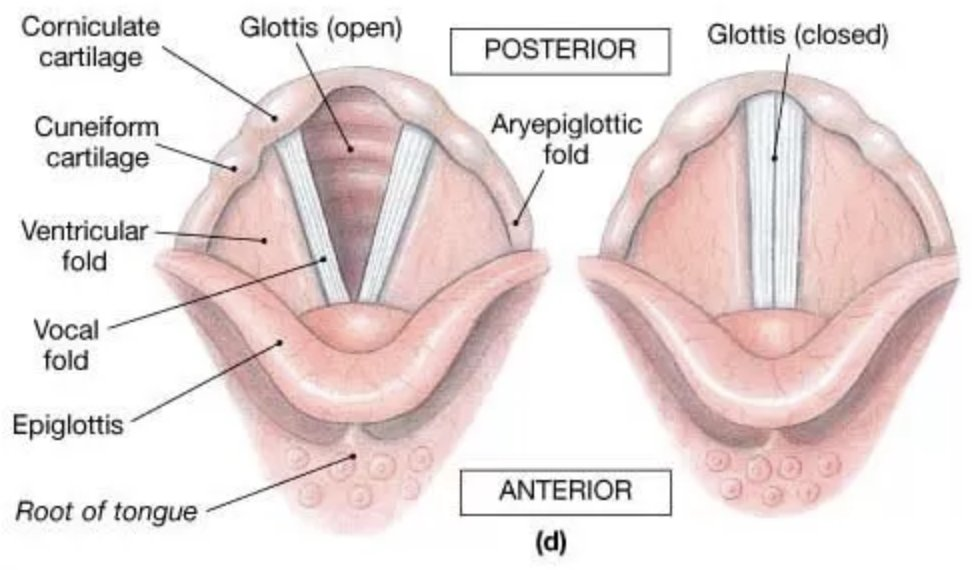
]

???

https://twitter.com/ilsmedical_/status/1420973919004024834

---

# The vocal folds

.center[

]

???

https://www.researchgate.net/figure/Glottis-True-Vocal-Cords-2011_fig3_301765137

---

# The vocal folds

.center[
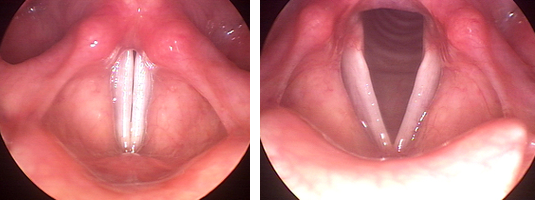
]

???

https://svas.tech-strategic.com/wp-content/uploads/2016/01/larynx.png

---

# Vocal fold vibration

.center[
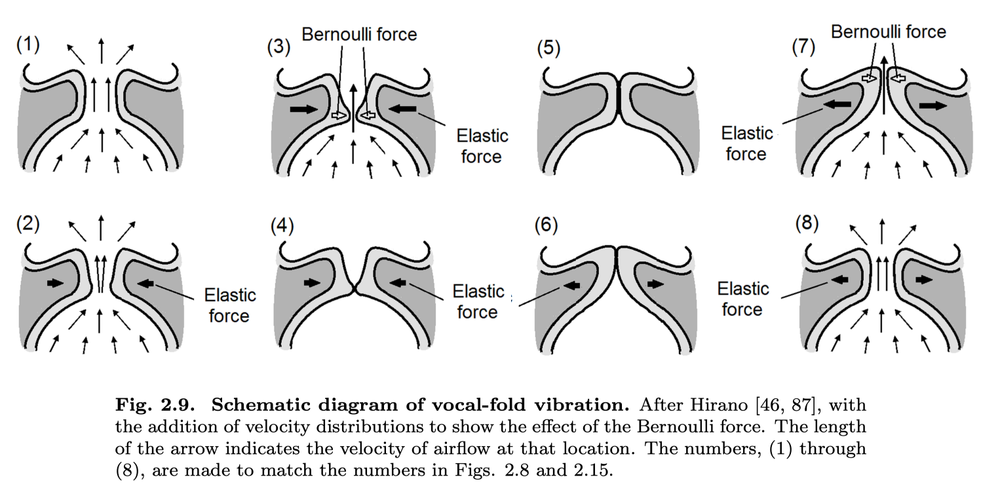
]

---

background-image: url(img/chris-robert-unsplash.jpg)
class: bottom center inverse

# BREAK

---

# Electroglottography

.center[
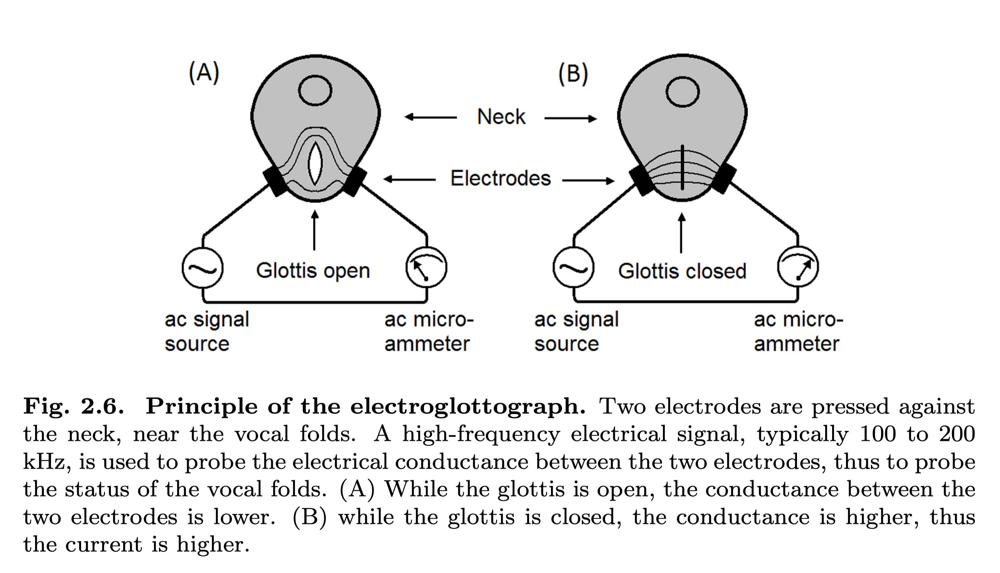
]

---

# Electroglottography

.center[
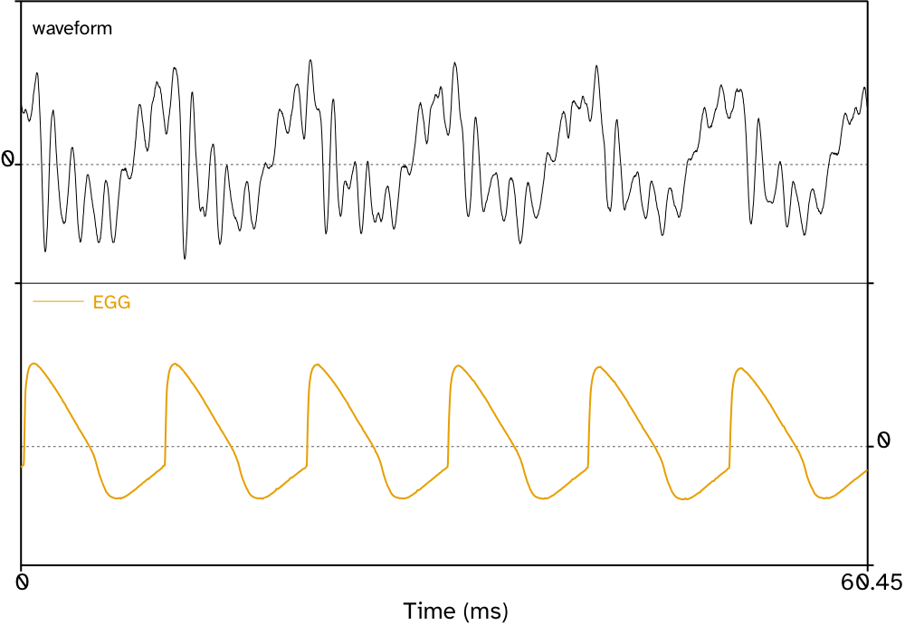
]

---

# Electroglottography

.center[
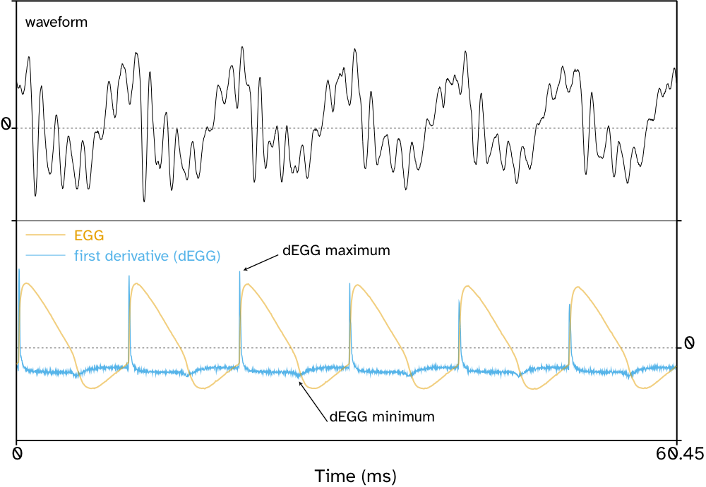
]
