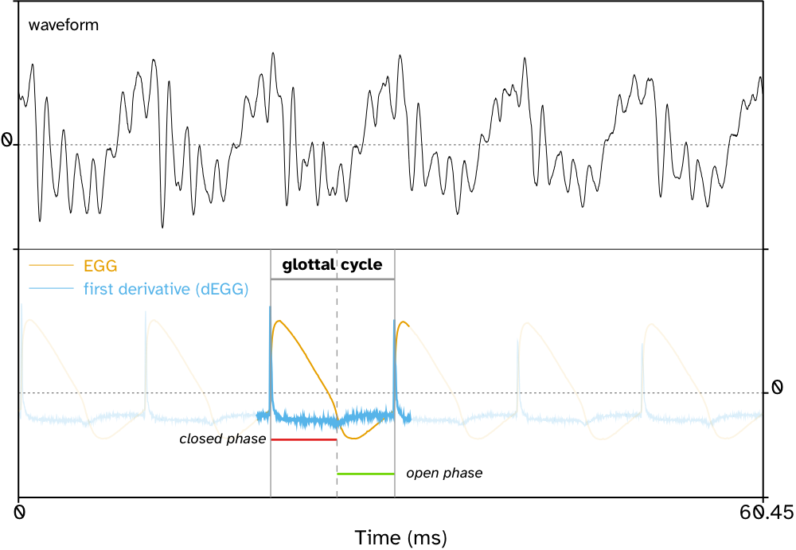
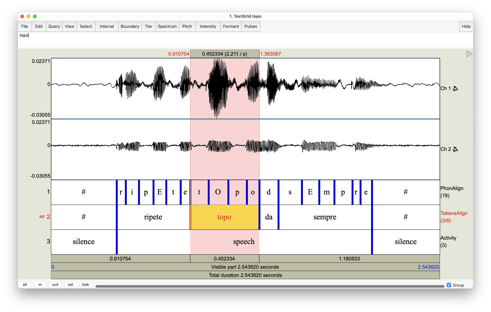
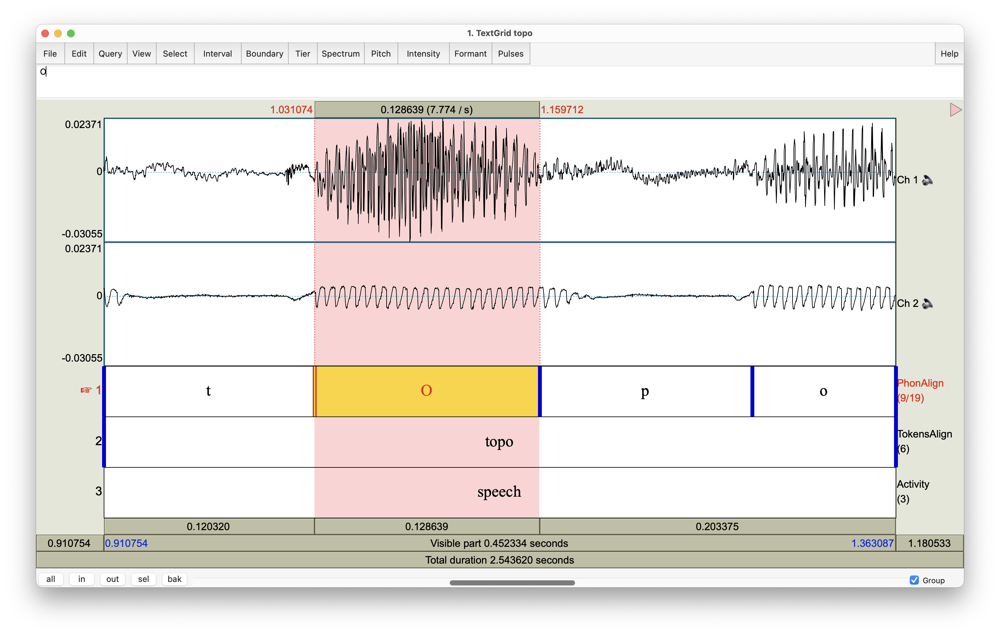
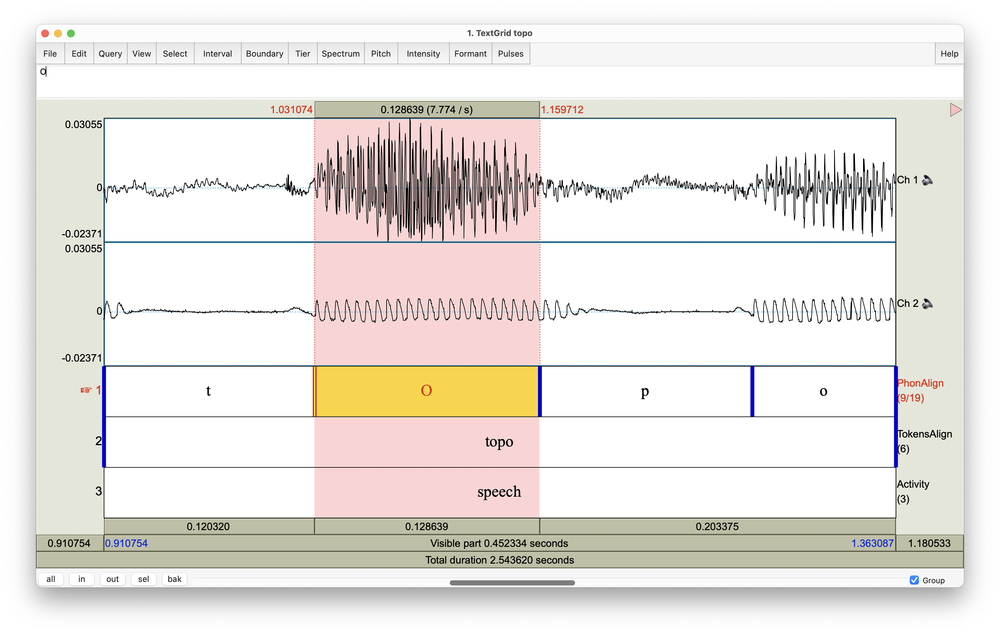
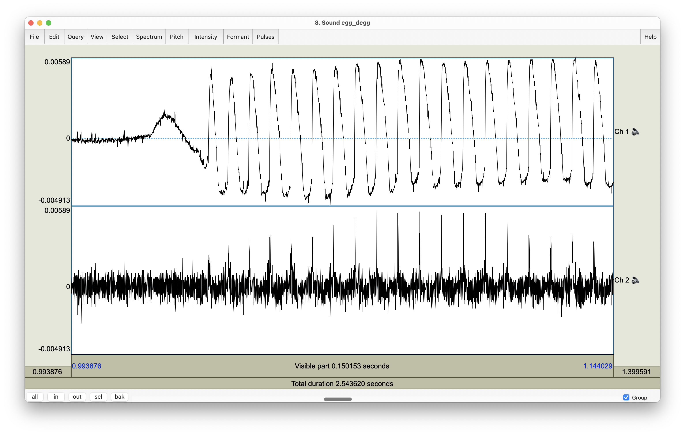
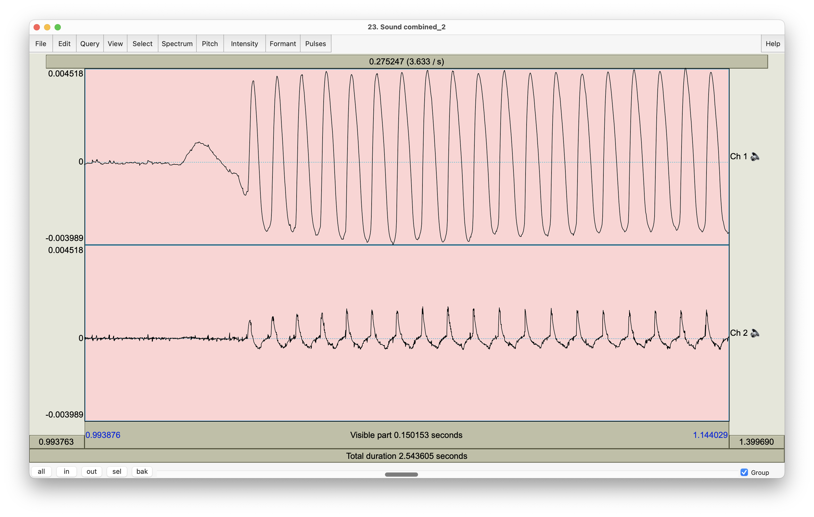

class: center middle inverse

# ANATOMY

---

# The vocal tract

.pull-left[
.center[

]]

.pull-right[
.center[

]]

???

Images:

- <a href="https://commons.wikimedia.org/wiki/File:Larynx_and_nearby_structures.jpg">Alan Hoofring (Illustrator)</a>, Public domain, via Wikimedia Commons
- https://thebrain.mcgill.ca/flash/capsules/outil_bleu21.html


---

# The larynx

.pull-left[

]

.pull-right[

]


???

- https://commons.wikimedia.org/wiki/File:Illu07_larynx01.jpg
- https://www.pinterest.co.uk/pin/565201821964547797/

---

# The larynx

.center[

]

???

- https://www.online-sciences.com/wp-content/uploads/2021/06/larynx-999.jpg

---

# The vocal folds

.center[

]

???

https://twitter.com/ilsmedical_/status/1420973919004024834

---

# The vocal folds

.center[

]

???

https://www.researchgate.net/figure/Glottis-True-Vocal-Cords-2011_fig3_301765137

---

# The vocal folds

.center[

]

???

https://svas.tech-strategic.com/wp-content/uploads/2016/01/larynx.png

---

# Vocal fold vibration

.center[

]

---

background-image: url(img/chris-robert-unsplash.jpg)
background-size: cover

class: bottom center inverse

# BREAK

---

# Electroglottography

.center[

]

---

# Electroglottography

.center[

]

---

# EGG signal

Vocal Fold Contact Area

???

Literature on what EGG signal captures.

---

# Glottal cycle

???

Literature on methods to detect glottal cycle.

Terminology: contact area, closed vs open phase, instants.

---

# Glottal cycle: dEGG method

.center[

]

---

# Glottal cycle: dEGG method

.center[

]

---

# Use cases

- Robust estimation of fundamental frequency (f0).

- Detection of voiced/voiceless intervals.

- Voice quality via Contact Quotient (CQ): higher CQ = creakier voice, lower CQ = breathier voice.

- Vocal Folds configuration via complex methods like wavegram.

---

# Limitations

- Only works when there is vocal fold vibration (i.e. no information about voiceless intervals).

- Not as commonly used as other articulatory techniques which means not many standardised procedures.

---

background-image: url(img/scott-webb-ttCFWHrmWH4-unsplash.jpg)
background-size: cover

class: center inverse

# BREAK

???

Photo by <a href="https://unsplash.com/es/@scottwebb?utm_source=unsplash&utm_medium=referral&utm_content=creditCopyText">Scott Webb</a> on <a href="https://unsplash.com/s/photos/guinea-pig?utm_source=unsplash&utm_medium=referral&utm_content=creditCopyText">Unsplash</a>

---

background-image: url(img/erda-estremera-BGLdeLFuGfs-unsplash.jpg)
background-size: cover

class: bottom inverse

# HANDS ON

## Data collection

???

Photo by <a href="https://unsplash.com/@erdaest?utm_source=unsplash&utm_medium=referral&utm_content=creditCopyText">Erda Estremera</a> on <a href="https://unsplash.com/s/photos/paws?utm_source=unsplash&utm_medium=referral&utm_content=creditCopyText">Unsplash</a>

---

# Analysing the EGG signal

- Pre-processing:

  - Filtering.
  
  - Calculate first derivative (dEGG).
  
- Extract measurements:

  - Contact Quotient (ratio between closed phase and glottal cycle).

  - Wavegram (Herbst 2010).

- Analyse measurements:

  - ...
  
  - WaveGAMs (Coretta 2019g).


---

layout: true

# Pre-processing

---

.center[

]

---

.center[

]

---

The signal is inverted. Restore by multiplying the signal by -1.<sup>1</sup>

```praat
selectObject: "Sound topo"
Multiply: -1
```

.footnote[
[1] Not all EGG units invert the signal.
]

---

.center[

]

---

We can extract the EGG signal from Channel 2.

```praat
selectObject: "Sound topo"
Extract one channel: 2
```

---

Let's create a copy and calculate the first derivative.

```praat
# Make a copy
selectObject: "Sound topo_ch2"
Copy: "topo_ch2_d"

# Calculate first derivative
Formula: "self [col + 1] - self [col]"

# Combine EGG and dEGG into a stereo sound
selectObject: "Sound topo_ch2"
plusObject: "Sound topo_ch2_d"
Combine to stereo
```

---

.center[

]

---

Let's pass-band filter the EGG signal, then we apply a smoothing filter.<sup>1</sup>

```praat
# Pass-band filter
selectObject: "Sound topo_ch2"
Filter (pass Hann band): 40, 10000, 100

# Smoothing filter
smooth_width = 11
@smoothing: smooth_width

# Smoothing shifts the signal
# So let's shift it back
sampling_period = Get sampling period
time_lag = (smooth_width - 1) / 2 * sampling_period
Shift times by: time_lag
```

.footnote[
[1] See next slide for `smoothing` procedure.
]

---

The following defines the `smoothing` procedure (i.e. a triangular filter).

```praat
procedure smoothing : .width
    .weight = .width / 2 + 0.5

    .formula$ = "( "

    for .w to .weight - 1
        .formula$ = .formula$ + string$(.w) + " * (self [col - " + string$(.w) + "] +
            ...self [col - " + string$(.w) + "]) + "
    endfor

    .formula$ = .formula$ + string$(.weight) + " * (self [col]) ) / " +
        ...string$(.weight ^ 2)

    Formula: .formula$
endproc
```

---

Now we can calculate the first derivative on the smoothed signal (dEGG).

```praat
# Make a copy
selectObject: "Sound topo_ch2"
Copy: "topo_ch2_d"

# Calculate first derivative
Formula: "self [col + 1] - self [col]"
```

---

.center[

]

---

layout: false

# BREAK

---

# Extract measurements

---

# References

<https://stefanocoretta.github.io/biblio/>