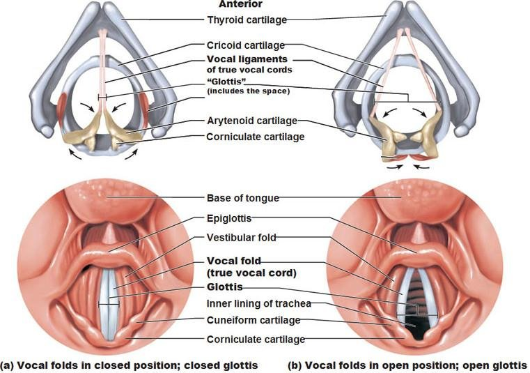

class: center middle inverse

# ANATOMY

---

# The vocal tract

.pull-left[
.center[

]]

.pull-right[
.center[

]]

???

Images:

- <a href="https://commons.wikimedia.org/wiki/File:Larynx_and_nearby_structures.jpg">Alan Hoofring (Illustrator)</a>, Public domain, via Wikimedia Commons
- https://thebrain.mcgill.ca/flash/capsules/outil_bleu21.html

---

# The larynx

.pull-left[

]

.pull-right[

]

???

- https://commons.wikimedia.org/wiki/File:Illu07_larynx01.jpg
- https://www.pinterest.co.uk/pin/565201821964547797/

---

# The larynx

.center[

]

???

- https://www.online-sciences.com/wp-content/uploads/2021/06/larynx-999.jpg

---

# The vocal folds

.center[

]

???

https://twitter.com/ilsmedical_/status/1420973919004024834

---

# The vocal folds

.center[

]

???

https://www.researchgate.net/figure/Glottis-True-Vocal-Cords-2011_fig3_301765137

---

# The vocal folds

.center[

]

???

https://svas.tech-strategic.com/wp-content/uploads/2016/01/larynx.png

---

# Vocal fold vibration

.center[

]

---

background-image: url(img/chris-robert-unsplash.jpg)
background-size: cover

class: bottom center inverse

# BREAK

---

# Electroglottography

.center[

]

---

# Electroglottography

.center[

]

---

# EGG signal

Vocal Fold Contact Area

???

Literature on what EGG signal captures.

---

# Glottal cycle

???

Literature on methods to detect glottal cycle.

Terminology: contact area, closed vs open phase, instants.

---

# Glottal cycle: dEGG method

.center[

]

---

# Glottal cycle: dEGG method

.center[

]

---

# Use cases

- Robust estimation of fundamental frequency (f0).

- Detection of voiced/voiceless intervals.

- Voice quality via Contact Quotient (CQ): higher CQ = creakier voice, lower CQ = breathier voice.

- Vocal Folds configuration via complex methods like wavegram.

---

# Limitations

- Only works when there is vocal fold vibration (i.e. no information about voiceless intervals).

- Not as commonly used as other articulatory techniques which means not many standardised procedures.

---

background-image: url(img/scott-webb-ttCFWHrmWH4-unsplash.jpg)
background-size: cover

class: center inverse

# BREAK

???

Photo by <a href="https://unsplash.com/es/@scottwebb?utm_source=unsplash&utm_medium=referral&utm_content=creditCopyText">Scott Webb</a> on <a href="https://unsplash.com/s/photos/guinea-pig?utm_source=unsplash&utm_medium=referral&utm_content=creditCopyText">Unsplash</a>

---

background-image: url(img/erda-estremera-BGLdeLFuGfs-unsplash.jpg)
background-size: cover

class: bottom inverse

# HANDS ON

???

Photo by <a href="https://unsplash.com/@erdaest?utm_source=unsplash&utm_medium=referral&utm_content=creditCopyText">Erda Estremera</a> on <a href="https://unsplash.com/s/photos/paws?utm_source=unsplash&utm_medium=referral&utm_content=creditCopyText">Unsplash</a>

